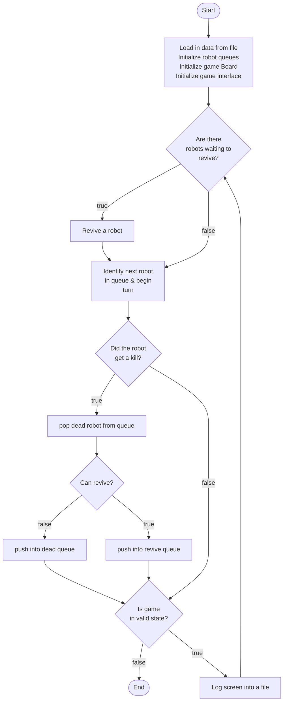

# OOPDS-assignment

## Class Diagram

## High-level Simulation Flow

```mermaid
     graph TD
     starts(["Start"])
     --> init["Load in data from file\nInitialize robot queues\nInitialize game Board\nInitialize game interface"]
     --> checkRevives{"Are there\n robots waiting to\n revive?"}
     --true--> revive["Revive a robot"] --> nextTurn
     checkRevives --false--> nextTurn["Identify next robot\nin queue & begin\nturn"]
     --> isKill{"Did the robot\nget a kill?"}
     --true--> removeFromQueue["pop dead robot from queue"]
     --> canRevive{"Can revive?"}
     --false--> pushDead["push into dead queue"]
     --> checkGameState
     canRevive --true--> pushRevive["push into revive queue"]
     --> checkGameState
     isKill --false--> checkGameState{"Is game\nin valid state?"}
     --false--> ends(["End"])
     checkGameState --true--> log["Log screen into a file"]
     --> checkRevives
```
